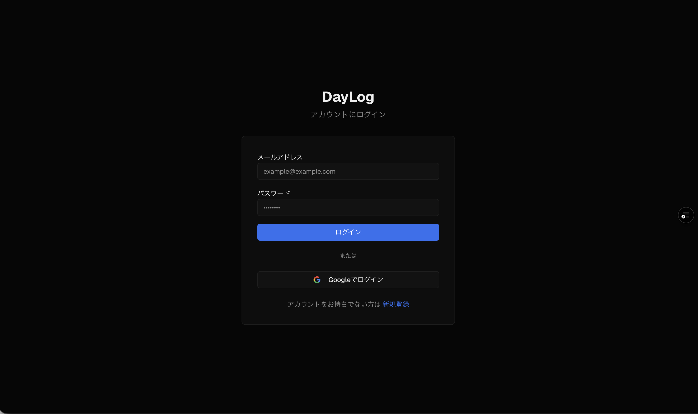
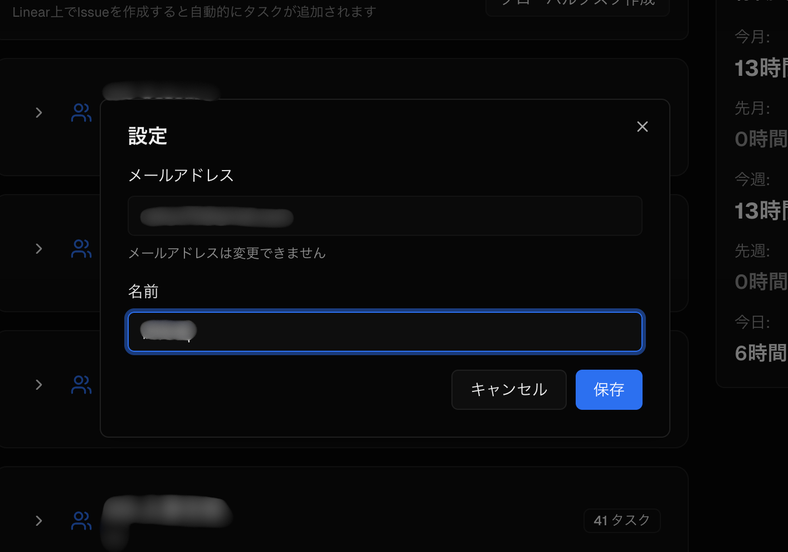
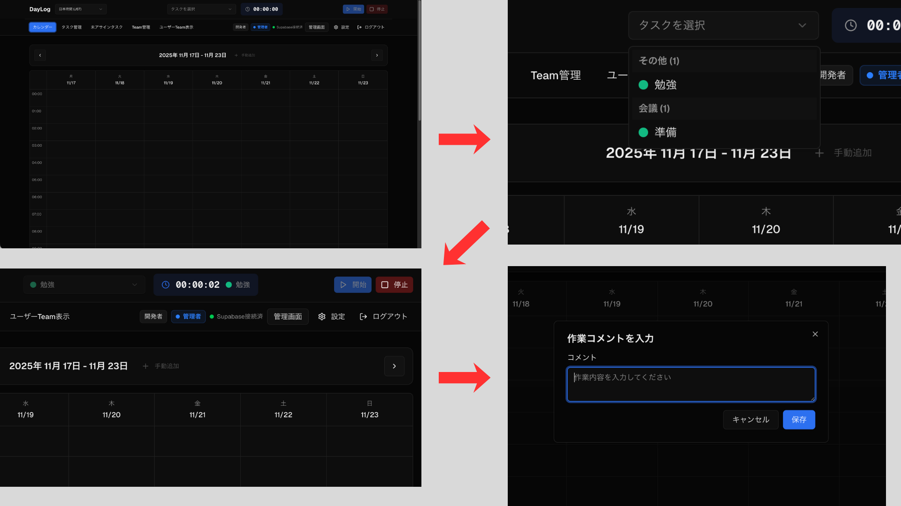
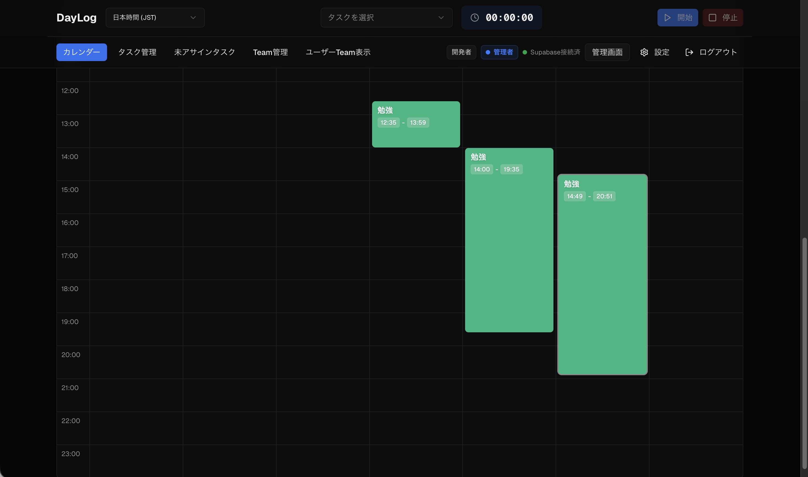
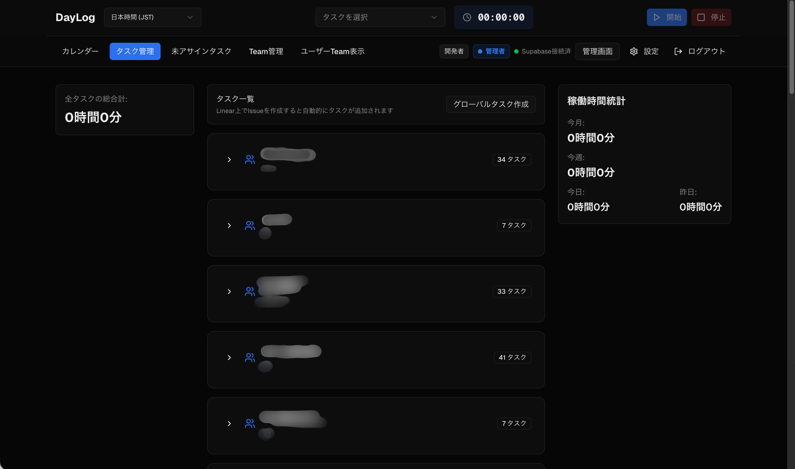
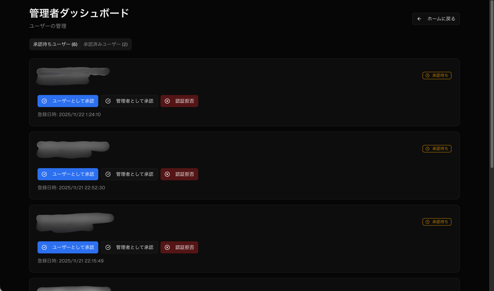
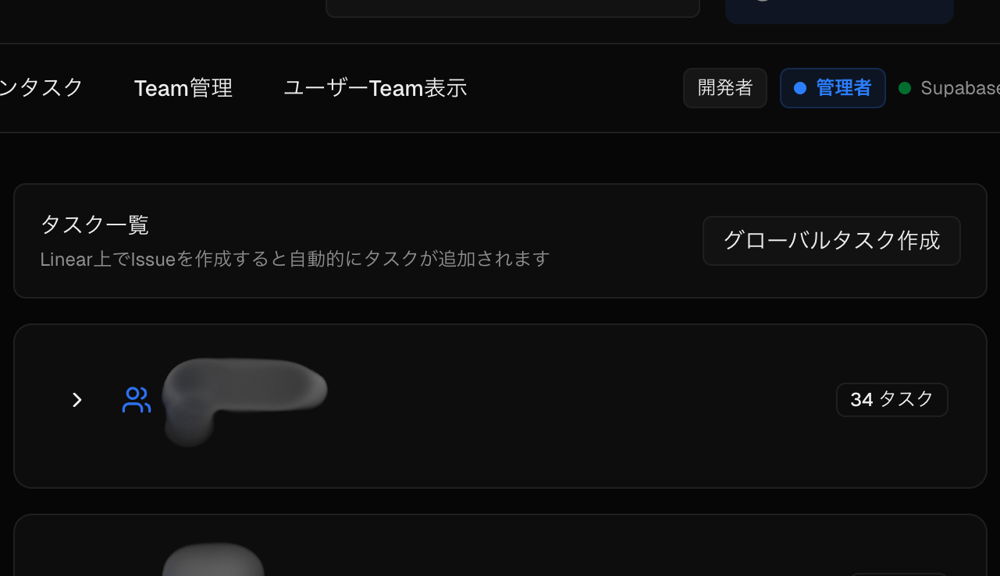
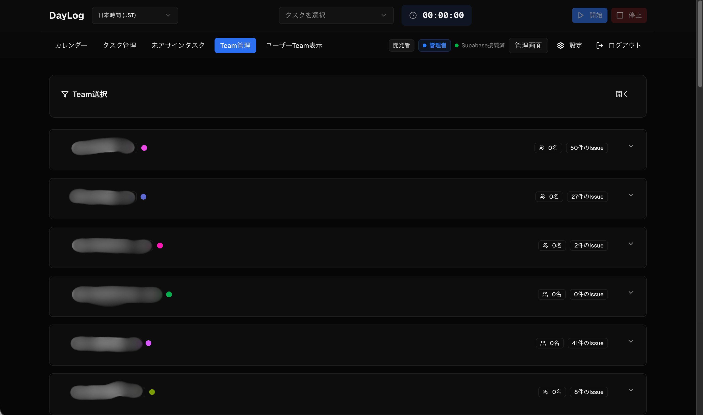
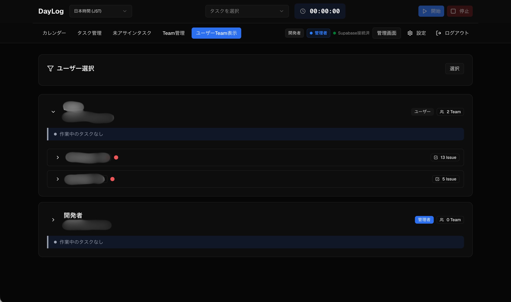

# DayLog

作業時間を記録し、日報を自動生成するチーム向けアプリケーション

DayLogは、日々の作業時間を簡単に記録し、チーム全体の作業状況を可視化するWebアプリケーションです。Linear連携により、Issueの自動同期も可能で、エンジニアチームやビジネスチームの生産性向上をサポートします。

---

## 主な機能

### 📊 作業時間の記録と管理

- ワンクリックタイマー: タスクを選択してスタートボタンを押すだけで、作業時間の記録を開始
- 自動日報生成: 記録した作業時間から、自動的に日報を生成
- Google Sheets連携: 作業記録を自動的にGoogle Sheetsに出力し、管理や集計が簡単

### 📅 視覚的なカレンダービュー

- 週間カレンダー: 1週間の作業時間を一目で確認
- タスク別色分け: タスクごとに色分けされ、作業の内訳が分かりやすい
- 日別・週別切り替え: 日ごと、週ごとの表示を自由に切り替え

### 🔗 Linear連携

- Issue自動同期: LinearのIssueを自動的にタスクとして取り込み
- リアルタイム更新: Webhook連携により、Issueの変更がリアルタイムで反映
- チーム・プロジェクト管理: Linear上のチームやプロジェクト構造をそのまま利用

### 👥 チーム作業の可視化

- チーム別表示: チームごとの作業時間や進捗を確認
- メンバー管理: 管理者による承認制で、セキュアなチーム運用
- 作業時間の共有: チーム全体の作業状況を共有し、コラボレーションを促進

---

## ユーザーと管理者共通の操作

### 1. ログイン

1. Googleアカウントでログイン
2. 初回ログイン時は, 管理者に承認を申請するため, 承認されるまで待ってください
3. **ログインした後に, 再度ログイン画面に戻されますが, 数秒待ったらアプリ画面に移るので待ってください**

### 2. 名前の設定

1. 画面右上にある設定ボタンを押す
2. 名前を入力して保存ボタンを押してください

- **この名前によって個人を識別するため, 重要です。ちゃんとフルネームで自分の名前を設定してください**

### 3. タスクの作成と時間記録

#### タスクを作成する

1. Linearでissueを作成すると, 自動でDayLogの方にも反映されます
2. Linearのissueに**assigneeを設定**してください. その人にのみタスクが表示されます

#### 作業時間を記録する

1. 記録したいタスクを選択
2. 「開始」ボタンをクリック
3. 作業が終わったら「停止」ボタンをクリック
4. コメントを追加して保存
5. 保存ボタンを押して元の画面に戻るまで待機してください

### 4. 作業時間の確認

#### カレンダービューで確認

- 週間カレンダーで1週間の作業時間を確認
- タスクをクリックすると詳細情報を表示
- 時間帯ごとの作業内容が一目で分かります

### 5. 稼働時間の統計

1. タスク管理画面に移動
2. 右側に稼働時間の統計が見れます

## 管理者のみが行える操作

### 1. 新規ユーザーの承認

1. 管理画面に移動
2. "ユーザーとして承認", "管理者として承認", "認証拒否"のいずれかを選択してください
3. 承認されたユーザーは, アプリ画面に移れるようになります

### 2. グローバルタスクの作成

1. タスク管理画面に移動
2. "グローバルタスク作成" ボタンを押すと, グローバルタスクを作成できるようになります

グローバルタスクとは, 全員に見えるタスクです

### 3. チーム別の表示

1. Team管理 画面に移動します
2. どのチームに誰が所属していて, 一人一人がどのタスクを担当しているか確認できます

### 4. ユーザーの作業確認

1. ユーザー管理 画面に移動します
2. どのユーザーがどのタスクを担当しているか確認できます

---

## Linear連携について

### Linearとは？

Linearは、エンジニアチーム向けのプロジェクト管理・Issue管理ツールです。

### DayLogとの連携でできること

- Issue自動同期: LinearのIssueがDayLogのタスクとして自動追加
- リアルタイム更新: Issueのステータス変更がリアルタイムで反映
- チーム・プロジェクト構造: Linearのチーム・プロジェクト構造をそのまま利用
- 担当者の自動設定: Issueの担当者が自動的にタスクに割り当て

### Linear連携の使い方

Linear連携が設定されている場合、以下のように自動的に動作します：

1. LinearでIssueを作成 → DayLogに自動的にタスクとして追加
2. Issueのステータス変更 → DayLogのタスクも自動更新
3. Issueの担当者変更 → DayLogのタスク担当者も自動更新

> **Note**: Linear連携の設定は管理者が行います。設定方法については管理者にお問い合わせください。

---

## サポート・お問い合わせ

- **Issues**: [GitHub Issues](https://github.com/CHU1PC/daily_report_system/issues)
- **質問・要望**: Issueを作成してください

---

## ライセンス

このプロジェクトはMITライセンスです。

---

### 最新版

- ユーザーTeam表示機能（メイン画面のみ）
- Linear Issue同期スクリプト
- 複数Webhook対応
- 管理画面でのユーザー削除機能（認証拒否対応）
- 日を跨ぐタスクのスプレッドシート自動同期
- カレンダー表示の修正（タイムゾーン対応）
